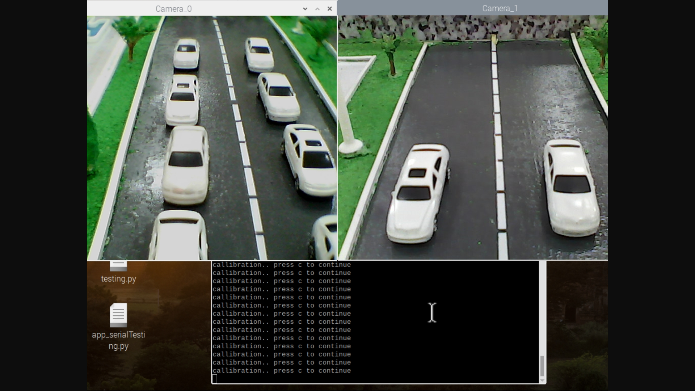
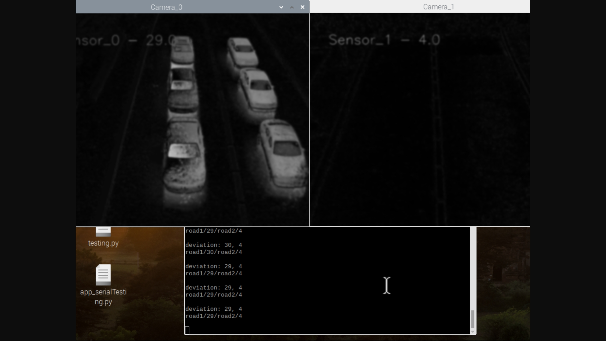
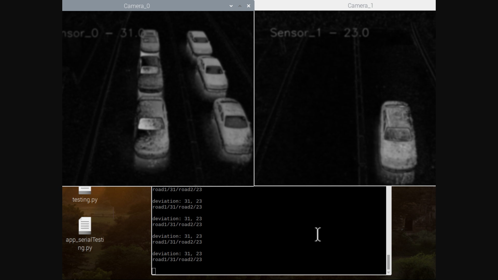

# Traffic App for traffic control, vehicle and pedestrian detection

**Aims of a project**

+ Detect and count vehicles from streams on traffic
+ Calculate and create efficient traffic light control
+ Secure pedestrians and cars from crash

---

## Prototype + realization

---

Documentation:
	+ [Project info enUS](documentation/project-info_enUS.md)
	+ [Project info ruRU](documentation/project-info_ruRU.md)
	+ [Project info tkTM](documentation/project-info_tkTM.md)

Documentation (docx format):
	+ [Smart Traffic enUS](documentation/SmartTraffic_enUS.docx)
	+ [Smart Traffic ruRU](documentation/SmartTraffic_ruRU.docx)
	+ [Smart Traffic tkTM](documentation/SmartTraffic_tkTM.docx)
